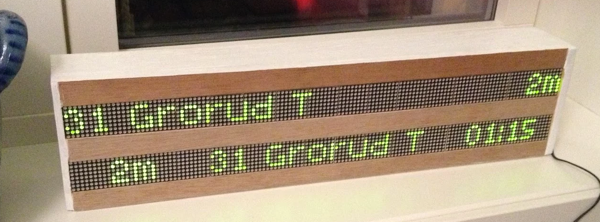

# trafikanten-hjemme



[](https://travis-ci.org/vramdal/trafikanten-hjemme)

## Requirements

```
> node --version
v8.12.0
```


## Installation
### Create Google Calendars
Create a calendar in Google Calendars. Call it "Public transport" or similar. 
Set up the display schedule as calendar events. Give each event a location.

Create another calendar, call it "Weather". Set up one or more events. Enter a valid location in the Location field. 

For each of the two calendars, copy the _private_ ICS URL and copy them into the ...

### Configuration file
Create a configuration file `.trafikanten-hjemme.json` in your home directory, with the following JSON structure:

```
{
   "calendars": [
      {
         "name": "Entur",
         "url": "YOUR-PUBLIC_TRANSPORT-ICS-URL-HERE",
         "messageProvider": "Entur",
         "displayEventTitle": true,
         "enabled": true
      },
      {
         "name": "Weather",
         "url": "YOUR-WEATHER-ICS-URL-HERE",
         "messageProvider": "Met",
         "displayEventTitle": true,
         "enabled": true
      }
   ],
   "googleMapsApiKey": "......",
   "oslobysykkel": {
      "apiKey": "BYSYKKEL_API_KEY"
   },
   "home": {E
      "coordinates": {
         "latitude": 59.123,
         "longitude": 10.456
      },
      "name": "Home, sweet home"
   }
}
```

Make sure you enter the coordinates for your home.

## Building the application
```
cd frontend
npm install
cd ../app
npm install
cd ..
```
Depending on your platform, one or more optional dependencies might fail to build. This is usually OK.

## Starting the application
```
cd bin
./run.sh
```

Browse to [http://localhost:6060/display/html-led.html](http://localhost:6060/display/html-led.html)